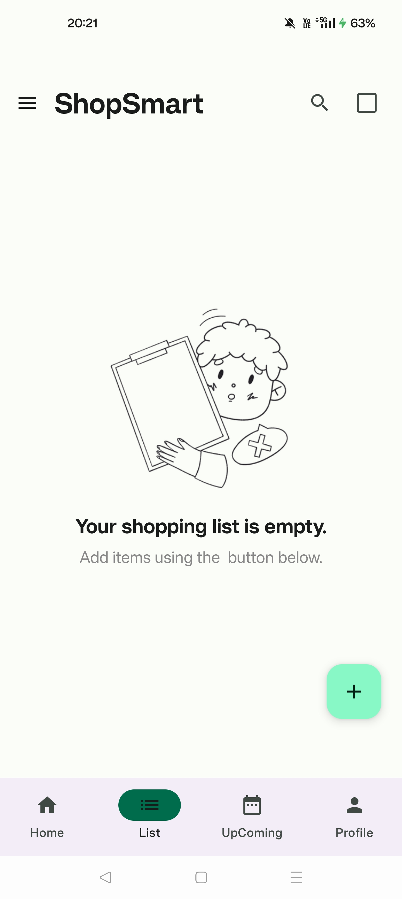
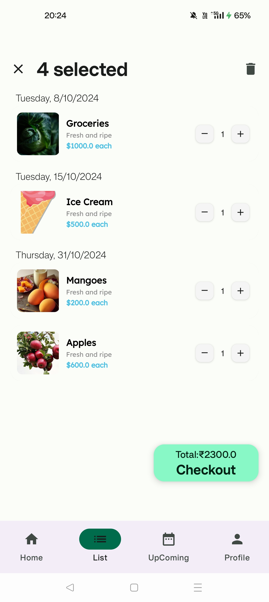
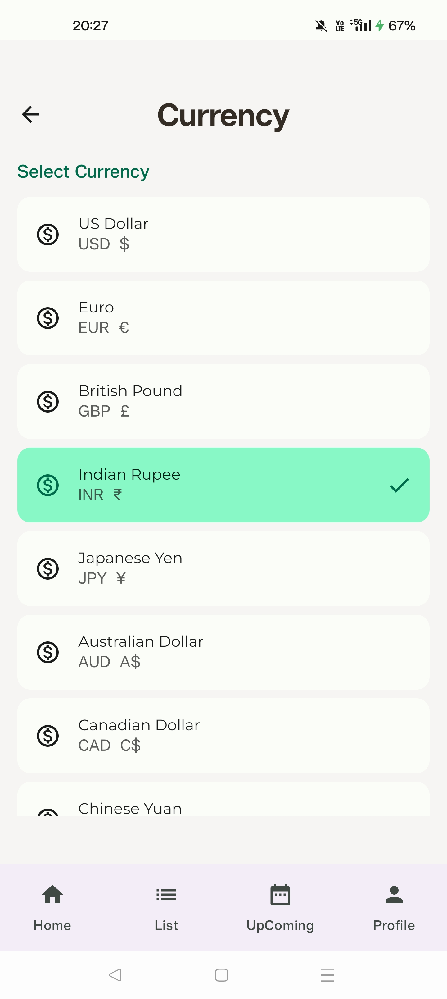

## 📋 Participating Programs

| Name                  | Logo                                                      | Purpose                                                                                                      |
|-----------------------|-----------------------------------------------------------|--------------------------------------------------------------------------------------------------------------|
| GSSoC'2024-Extd       |              | The coding period is from October 1st to October 30th, during which contributors make contributions and earn points on the platform. |
| Hacktoberfest 2024    |  | Hacktoberfest is a month-long October event welcoming all skill levels to join the open-source community.     |

<!--Line-->


# **ShopSmart: Your Smart Shopping Companion**

**Effortless shopping, simplified.** 🛒

ShopSmart is a user-friendly shopping list app built with Kotlin and Jetpack Compose. From organizing items by category to adding them through voice commands, ShopSmart helps you streamline your grocery shopping experience—whether you're online or offline.

<!-- Added Hacktoberfest 2024 and GSSoc Extended 2024 banners -->

<!--<div align="center">
### This project is now OFFICIALLY accepted for
<!--    -->
<!--    
</div>
<br>-->

<!--Line-->


## **🔗 Table of Contents**
1. [Features](#features)
2. [Screenshots](#screenshots)
3. [Upcoming Features](#upcoming-features)
4. [Technologies Used](#technologies-used)
5. [Setup Guide](#setup-guide)
6. [Contributing](#contributing)
7. [License](#license)

<!--Line-->


## **✨ Features**

### Shopping & Navigation
- **Smart Search**: Voice and text search functionality with product suggestions
- **Personalized Categories**: Electronics, Fashion, Home & Living, Books, Sports, Beauty, Toys, and Automotive sections
- **Shopping Interest Filters**: Customizable feeds with New Arrivals, Deals, Premium, Sustainable, Trending, Handmade, Limited Edition, and Local Sellers
- **Featured Products**: Curated product listings with ratings, discounts, and vendor information
- **Wishlist & Favorites**: Save items with price tracking and stock notifications

### List Management
- **Smart Shopping Lists**: Create and manage dated shopping lists with images
- **Quantity Controls**: Easy increment/decrement buttons for item quantities
- **Price Tracking**: Automatic total calculation and per-item pricing
- **Empty State Handling**: User-friendly prompts to add items when lists are empty
- **Multiple List Support**: Create and manage multiple shopping lists with dates

### Order Management
- **Comprehensive Order Tracking**: Real-time updates for order confirmation, shipping, and delivery
- **Order Notifications**: Customizable alerts for:
   - Order confirmation
   - Shipping status changes
   - Delivery updates
   - Order cancellations
   - Price drops on wishlist items
   - Back-in-stock alerts

### Payment & Refunds
- **Multi-Currency Support**: USD, EUR, GBP, INR, JPY, AUD, CAD, and CNY
- **Flexible Refund System**:
   - Multiple refund methods (Original Payment, Store Credit, Bank Account)
   - Automatic refund processing
   - Refund status notifications
   - Customizable refund preferences

### User Experience
- **Profile Management**: Customizable user profiles with profile picture
- **Customer Support**: Multiple contact channels including:
   - Email support (support@shopsmart.com)
   - Sales inquiries (sales@shopsmart.com)
   - Direct phone support
   - In-app messaging

<!--Line-->


## **Upcoming Features**

- **Enhanced Item Sorting**: Advanced categorization and filtering options
- **Voice Commands**: Expanded voice functionality for hands-free operation
- **Shopping Analytics**: Personal shopping insights and trends
- **Social Shopping**: List sharing and collaborative shopping features
- **Dark Mode**: Enhanced visibility with dark theme option
- **Barcode Scanner**: Quick item addition using device camera
- **Shopping Route Optimization**: Smart shopping trip planning
- **Budget Tracking**: Advanced budget management tools
- **AI-Powered Recommendations**: Personalized product suggestions
- **Seasonal Shopping Lists**: Templates for holiday and special occasions

<!--Line-->


## **Technologies Used**

- **Kotlin**: The primary programming language used for app development.
- **Android SDK**: Android Software Development Kit for building Android apps.
- **MVVM Architecture**: Model-View-ViewModel architecture pattern for clean and maintainable code.
- **Room**: Used for local database management and data storage.
- **Retrofit**: HTTP client for API requests.
- **Pixabay API**: Used to fetch images for list creation.
- **ViewModel**: Manages UI-related data in a lifecycle-conscious way.

<!--Line-->


## **Screenshots**
| App Splash Screen              | Shopping List Creation           |
|--------------------------------|----------------------------------|
|  |  |

| Intuitive Checkout Screen      | Contact Us Page                     |
|--------------------------------|-------------------------------------|
|  |  |

| Currency Selection Screen      | Refund Settings Screen              |
|--------------------------------|-------------------------------------|
|  |  |

| Recommendations Screen         | Profile Screen                      |
|--------------------------------|-------------------------------------|
|  |  |

| Order Notifications Screen      |
|---------------------------------|
|  |

<!--Line-->


## **🚀 Setup Guide**

To get started with ShopSmart, follow these steps:

1. **Fork It**: Fork the project to create your own copy.

2. **Clone the repository:**

   ```bash
   $ git clone https://github.com/<your-account-username>/<your-forked-project>.git
   ```

3. **Open in Android Studio**:  
   Open the cloned project in Android Studio.

4. **Build & Run**:  
   Connect your Android device or launch an emulator, then hit the **Run** button in Android Studio to build and deploy the app.

<!--Line-->


## **🤝Contributing**

We’re excited for you to contribute to ShopSmart! 

Please refer the [Contributors Guide](./contributors.md) Before you start Contributing.

<!--Line-->


## Important Guidelines ⚡

1. Contributors should only work on issues that have been assigned to them.
2. Each pull request should be associated with one issue only.
3. No minor text edits should be submitted unless necessary.
4. Unethical behavior, tampering with files, or harassment will result in disqualification.
5. Follow the community guidelines while contributing to ensure a healthy collaborative environment.
6. No Issue Repetitions are allowed.
7. Check the issues before you raise an issue.
8. No Plagiarism of Codes.
9. Make sure the Code is genuine and it helps maximum to this project.

<!--Line-->


## Community Guidelines 🤝

Please follow these guidelines while contributing:

- Be respectful and considerate towards others.
- Use inclusive language and foster a welcoming environment.
- Avoid personal attacks, harassment, or discrimination.
- Keep discussions focused on constructive topics.

- ## Code Reviews ✅

- Be open to feedback from other contributors.
- Participate in code reviews to help improve the project.

<!--Line-->


<!-- Modified the Contributors Mention Section -->
<div>
  <h2 align = "center">Our Contributors</h2>
  <div align = "center">
 <h3>Thank you for contributing to our repository</h3>


</div>

<!--Line-->


## **Code of Conduct**

Please note that this project is released with a [Contributor Code of Conduct](https://www.contributor-covenant.org/). By participating in this project, you agree to abide by its terms.

<!--Line-->


## **📜License**

This project is licensed under the MIT License. See the [LICENSE](LICENSE) file for details.

<!--Line-->


<!-- Added Team section -->
## 👥 Team
|  |
|:--:|
| **Yuvraj Singh** <br> <sub>Project Admin</sub> | 
| [](https://www.linkedin.com/in/yuvrajsinghgmx/) |

For any inquiries or feedback, please contact. Happy Contributing 🫡

<!--Line-->


## **🙏 Support**

Found a bug or have a feature request? Please open an issue.
If you like the project, don't forget to give it a ⭐!

**Crafted with ❤️  by Yuvraj Singh**
